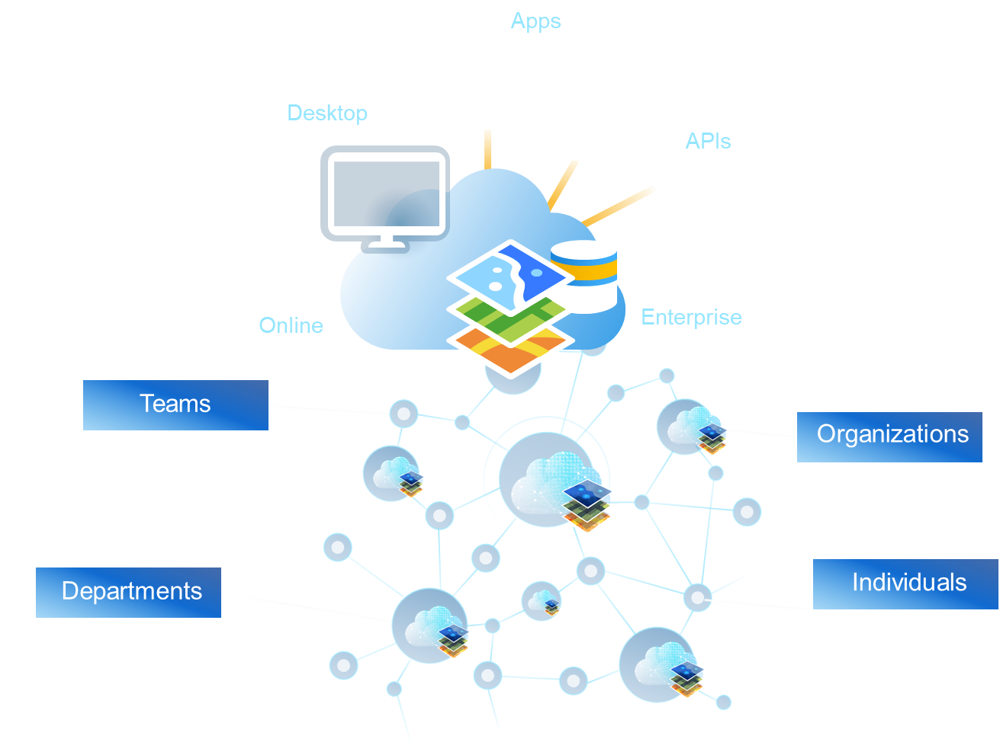
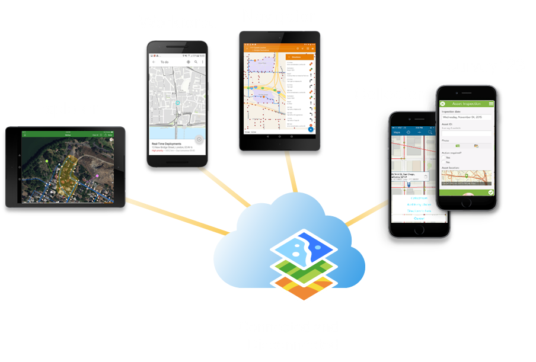
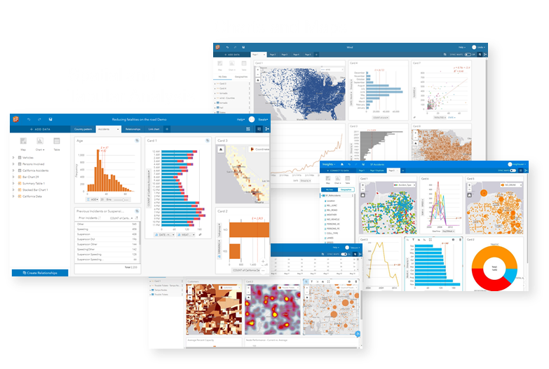
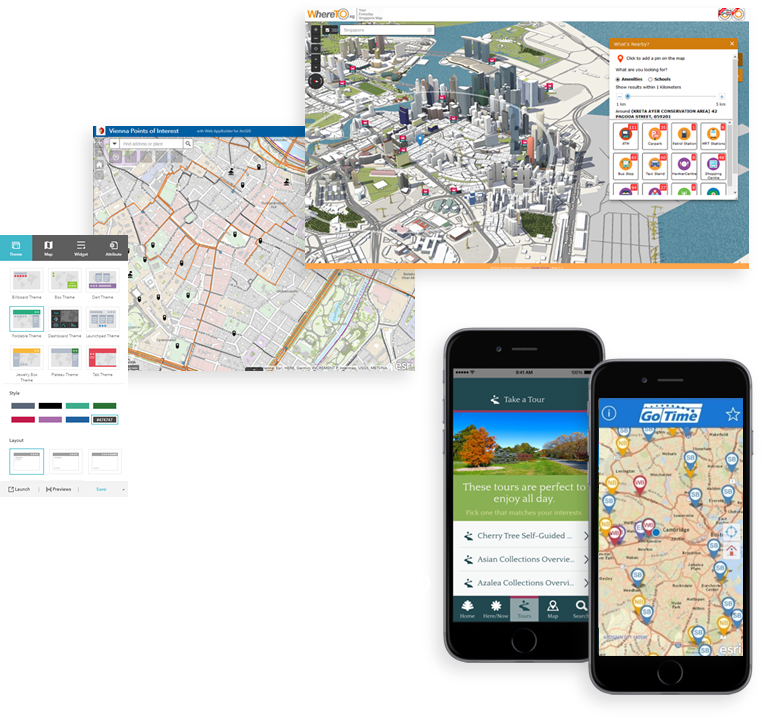
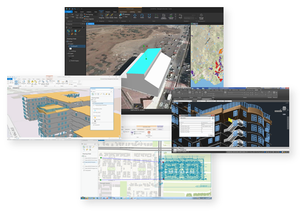
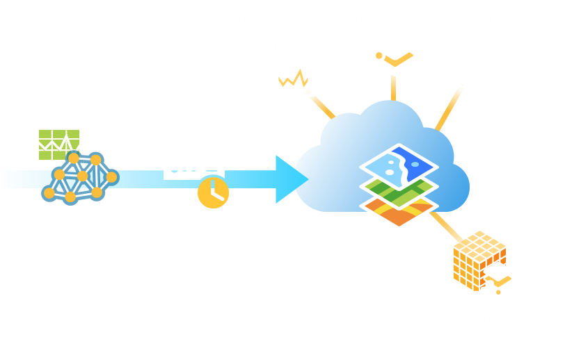
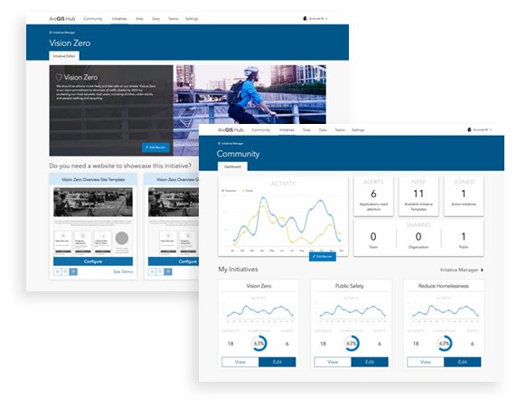

<!-- .slide: class="title" -->

## GeoDev Hackerlab - PDX
Mara Stoica & René Rubalcava

---

<!-- .slide: class="agenda" -->

## What is a GeoDev hackerlab?

Build geo aps with ArcGIS

---

<!-- .slide: class="agenda" -->

## Format

Demos and short labs

---

## Questions for you

How familiar are you with:

1. ArcGIS Online (maps, data, services, analysis)
2. ArcGIS API for JavaScript

---

<!-- .slide: class="agenda" -->

## Agenda

- Platform
- Data
- Design
- Develop

---

<!-- .slide: class="section" -->

# ArcGIS Platform

---

    

    
 
   <h3> Location Intelligence Everywhere </h3>
   <ul>
  <li>SaaS mapping and location platform</li>
  <li>Comprehensive GIS</li>
</ul>
     

    
 
        
    

    

---

<!-- .slide: class="section" -->

## ArcGIS Online
- 2D and 3D
- Create and visualize web maps and web scenes
- Your data, fully hosted
- Suite of rich basemaps
- Imagery and demographics data
- Geocoding, routing, geoenrichment
- JavaScript API

---

<!-- .slide: class="section" -->

## Story Maps and Dashboard Apps

---

<!-- .slide: class="section" -->

## Field Apps

                        http://esriurl.com/hackpdx

---

<!-- .slide: class="section" -->
## Insights

---

<!-- .slide: class="section" -->
## App Builders

---

<!-- .slide: class="section" -->
## ArcGIS Enterprise
- System of record and engagement
- GIS in your own infrastructure
- Data management, mapping, analysis
- Utility networks
- Geostatistics, spatial statistics and pattern mining
- Image analysis
- Big data spatial analytics
- Real time analytics

---

<!-- .slide: class="section" -->
## ArcGIS Pro

---

<!-- .slide: class="section" -->
## GeoEvent Server

---

<!-- .slide: class="section" -->
## ArcGIS Hub

---

## ArcGIS Dev Process

---

## Getting set up

1. Sign up for FREE ArcGIS Developer Account
2. Explore some projects on esri.github.io
3. Explore ArcGIS.com

Voucher Code: *PDXJUN2018*

---

<!-- .slide: class="section" -->

# Data

---

## [Import Data](https://developers.arcgis.com/labs/arcgisonline/import-data/)

---

## [Create a new Dataset](https://developers.arcgis.com/labs/arcgisonline/create-a-new-dataset/)

---

## [Explore Layer Data](https://developers.arcgis.com/labs/arcgisonline/explore-layer-data/)

---

<!-- .slide: class="section" -->

# Design

---

## [Create a Webmap](https://developers.arcgis.com/labs/arcgisonline/create-a-web-map/)

---

## [Style a Webmap](https://developers.arcgis.com/labs/arcgisonline/style-a-web-map/)

---

## [Style a Vector Basemap](https://developers.arcgis.com/labs/arcgisonline/style-a-vector-basemap/)

---

## [Configure Popups](https://developers.arcgis.com/labs/arcgisonline/configure-pop-ups/)

---

## [Style feature layers with smart mapping](https://developers.arcgis.com/labs/arcgisonline/style-feature-layers-with-smart-mapping/)

---

<!-- .slide: class="section" -->

# Develop

---

## [Display a Webmap](https://developers.arcgis.com/labs/javascript/display-a-web-map/)

---

## [Display a styled vector basemap](https://developers.arcgis.com/labs/javascript/display-a-styled-vector-basemap/)

---

## [Create a 2D map with a layer](https://developers.arcgis.com/labs/javascript/create-a-2d-map-with-a-layer/)

---

## [Create a 3D scene with a layer](https://developers.arcgis.com/labs/javascript/create-a-3d-scene-with-a-layer/)

---

## [Style a feature layer](https://developers.arcgis.com/labs/javascript/style-a-feature-layer/)

---

## [Configure a pop-up](https://developers.arcgis.com/labs/javascript/configure-a-popup/)

---

## [Query a feature layer](https://developers.arcgis.com/labs/javascript/query-a-feature-layer/)

---

## [Create graphics](https://developers.arcgis.com/labs/javascript/create-graphics/)

---

## [Track your location](https://developers.arcgis.com/labs/javascript/track-your-location/)

---

## [Search and Geocode](https://developers.arcgis.com/labs/javascript/search-and-geocode/)

---

## [Get Driving Directions](https://developers.arcgis.com/labs/javascript/get-driving-directions/)

---

## [Access a private layer](https://developers.arcgis.com/labs/javascript/access-private-layers/)

---

## [@arcgis/cli](https://github.com/Esri/arcgis-js-cli)

---

<!-- .slide: class="section" -->

# Summary

---

<!-- .slide: class="questions" -->

## Questions?

---

<!-- .slide: class="end" -->